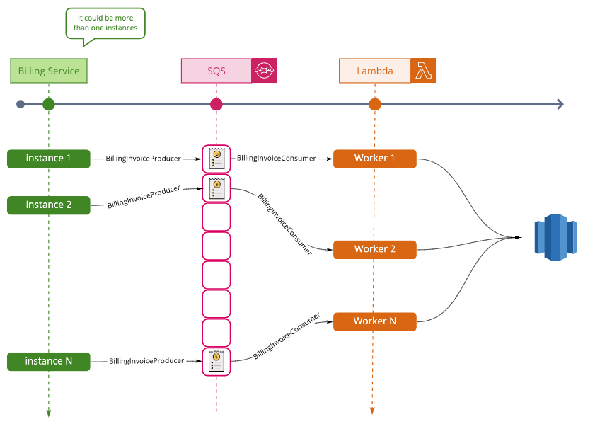
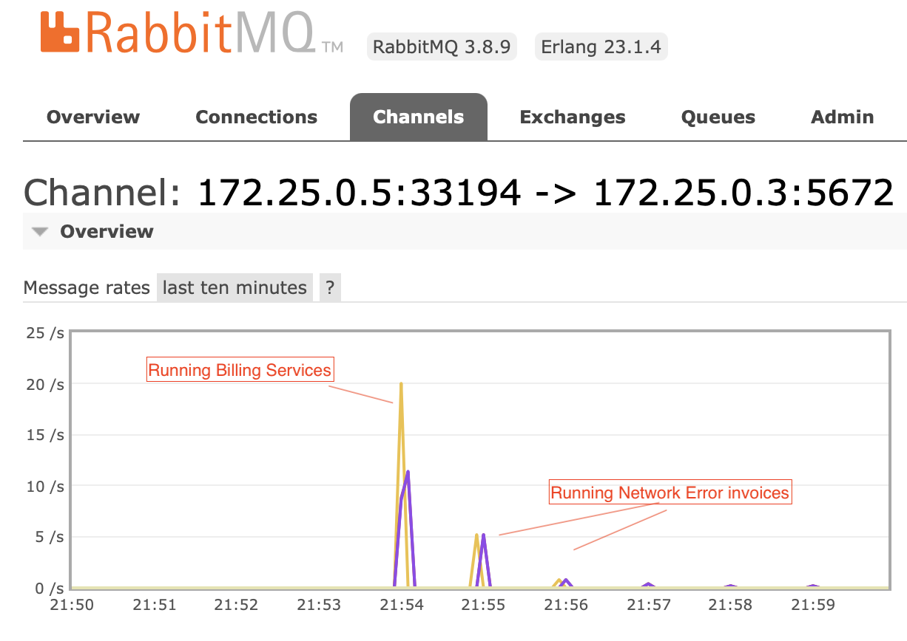

# Explanation of the developed solution
For the solution of the project, I have created a [Github project](https://github.com/carlosamoreno/antaeus/projects/1]) for tasks management. The project functionality is basically split in two: create a simple solution for the challenge (MVP - Minimum Viable Product) and the improvement of the scalability of the solution in the following iterations. Therefore, 4 [milestones](https://github.com/carlosamoreno/antaeus/milestones) were created

## [MVP Milestone](https://github.com/carlosamoreno/antaeus/milestone/1?closed=1) 
A basic solution of the challenge, not taking into consideration scalability:
### Billing service
Simply the billing service will update in an independent thread the database with the result from `paymentsProvider.charge`, including more statuses in the `InvoiceStatus` enum for covering all the possible situations of the `charge` method
```kotlin
fun processPendingInvoices() = launch { processInvoicesByStatus(InvoiceStatus.PENDING) }
fun processNetworkErrorInvoices() = launch { processInvoicesByStatus(InvoiceStatus.ERROR_NETWORK) }
    
 private fun processInvoicesByStatus(status: InvoiceStatus) {
     invoiceService
         .fetchByStatus(status)
         .forEach { invoice ->
             var invoiceProcessResult = invoice.status
             try {
                 invoiceProcessResult = if (paymentProvider.charge(invoice))
                     InvoiceStatus.PAID
                 else
                     InvoiceStatus.ERROR_NO_BALANCE

             } catch (err: Exception) {
                 invoiceProcessResult = when (err) {
                     is CustomerNotFoundException -> InvoiceStatus.ERROR_CUSTOMER_NOT_FOUND
                     is CurrencyMismatchException -> InvoiceStatus.ERROR_CURRENCY_MISMATCH
                     is NetworkException -> InvoiceStatus.ERROR_NETWORK
                     else -> InvoiceStatus.ERROR_UNKNOWN
                 }
             } finally {
                 invoiceService.updateInvoice(invoice.copy(status = invoiceProcessResult))
             }

         }
 }
```
There is no handler for how to behave after the charge response. I only included the basic scenario:
* Process unpaid invoices
* Retry those invoices with a network error 

I skipped the other scenarios as I wanted to focus in scalability and resilience. In case I wanted to improve this, using a [strategy pattern makes a lot of sense](https://github.com/carlosamoreno/antaeus/issues/17)

### Scheduler
A very simple scheduler using cron and running as a new service refactoring the docker implementation with a `docker-compose`. Having in mind the separation of concerns, the schedule work should be part of an independent solution / project. Ideally, [this project could be done in a more complete and secure way](https://github.com/carlosamoreno/antaeus/issues/16)

Two crons job have been scheduled:
* Process invoices in the first day of every month (sending a request to `/rest/v1/billing`´´
* Process those invoices with a `NETWORK_ERROR` every five minutes (sending a request to `/rest/v1/billing/retry)  

>At this poing, the solution resolves strictly the challenge as per the statement (charge the invoices monthly). Of course, real life is not that easy :-) 
 
## Making the solution more scalable
### [Improving Scalability Milestone](https://github.com/carlosamoreno/antaeus/milestone/2?closed=1) 
A quick and simple milestone to set the first stepping stone for a more split in services solution: migrating the database from sqlite to postgres in an independent service. Thanks to the usage of the libraries `exposed`, the migration from sqlite3 to postgres was quite simple. 

The interesting part is starting the development of the `docker-compose` file. At this point, the solution already has 3 services running in Docker: antaeus apps, the scheduler, and now the database.

Part of this milestone was also [scaling the Rest API](https://github.com/carlosamoreno/antaeus/issues/7), with an
 API gateway or a load balancer, but it was out of the
 scope of the challenge

### [Improving Resilience Milestone](https://github.com/carlosamoreno/antaeus/milestone/3?closed=1)
Having the database in an independent service is useful in terms of scalability Yes, we can scale the database if needed the first day of every month and scale it down afterwards. But, is it enough? Unfortunately no.
 
 We can face the following issues with the current approach:
 * Executing the billing service in the same app is not a good idea. Usually invoicing is an important process and commonly heavy in terms of time or resources that could create reliability or performance issues. 
 * Executing the invoicing in an independent thread is mandatory. But again, it could be not enough if the process takes hours. We need a more "agile" solution.
 * It wouldn't be nice the users have a decreased response time due to the invoicing. Scaling the server and the
  database would be the first step, but also it could be the more expensive way and maybe not enough.
 
The idea of this milestone is decoupling the BillingService from the solution to a `queue-based load leveling pattern
`. So the billing service is able to handle the invoices at its own pace, totally decoupled from the main service
. What I had in mind was converting every invoice to a message in a queue, and then using a lambda function per
 message with a trigger.



Due to limit the challenge to a local solution rather than deploying the solution to AWS, I tried to simulate what I wanted to really achieve: 
* AWS SQS was replaced by RabbitMQ 
* Instead of a lambda function, I implemented a consumer for the messages in the queue
 that automatically is executed after the message is received (no polling to the queue needed).
  
 This way, processing the invoices using multi-thread without any kind of work on the code. We are delegating the concurrency of the solution to the infrastructure basically (yes, the Cloud changed some development paradigms), as you can see per the logs (pool-1-thread-X)

```logs
pleo-antaeus_1  | [pool-1-thread-10] INFO io.pleo.antaeus.core.external.billing.BillingInvoiceConsumer -  [x] Received '{"id":861,"customerId":87,"amount":{"value":89.52,"currency":"USD"},"status":"PENDING"}'
pleo-antaeus_1  | [pool-1-thread-10] INFO io.pleo.antaeus.core.external.billing.BillingProcessor - updating invoice.id = Invoice(id=861, customerId=87, amount=Money(value=89.52, currency=USD), status=PENDING).id to status ERROR_NO_BALANCE
pleo-antaeus_1  | [pool-1-thread-5] INFO io.pleo.antaeus.core.external.billing.BillingInvoiceConsumer -  [x] Received '{"id":871,"customerId":88,"amount":{"value":418.31,"currency":"DKK"},"status":"PENDING"}'
pleo-antaeus_1  | [pool-1-thread-5] INFO io.pleo.antaeus.core.external.billing.BillingProcessor - updating invoice.id = Invoice(id=871, customerId=88, amount=Money(value=418.31, currency=DKK), status=PENDING).id to status ERROR_NO_BALANCE
pleo-antaeus_1  | [pool-1-thread-3] INFO io.pleo.antaeus.core.external.billing.BillingInvoiceConsumer -  [x] Received '{"id":881,"customerId":89,"amount":{"value":57.69,"currency":"USD"},"status":"PENDING"}'
pleo-antaeus_1  | [pool-1-thread-3] INFO io.pleo.antaeus.core.external.billing.BillingProcessor - updating invoice.id = Invoice(id=881, customerId=89, amount=Money(value=57.69, currency=USD), status=PENDING).id to status ERROR_NETWORK
pleo-antaeus_1  | [pool-1-thread-4] INFO io.pleo.antaeus.core.external.billing.BillingInvoiceConsumer -  [x] Received '{"id":891,"customerId":90,"amount":{"value":97.09,"currency":"USD"},"status":"PENDING"}'
pleo-antaeus_1  | [pool-1-thread-4] INFO io.pleo.antaeus.core.external.billing.BillingProcessor - updating invoice.id = Invoice(id=891, customerId=90, amount=Money(value=97.09, currency=USD), status=PENDING).id to status PAID
pleo-antaeus_1  | [pool-1-thread-6] INFO io.pleo.antaeus.core.external.billing.BillingInvoiceConsumer -  [x] Received '{"id":901,"customerId":91,"amount":{"value":427.84,"currency":"SEK"},"status":"PENDING"}'
pleo-antaeus_1  | [pool-1-thread-6] INFO io.pleo.antaeus.core.external.billing.BillingProcessor - updating invoice.id = Invoice(id=901, customerId=91, amount=Money(value=427.84, currency=SEK), status=PENDING).id to status ERROR_NO_BALANCE
pleo-antaeus_1  | [pool-1-thread-7] INFO io.pleo.antaeus.core.external.billing.BillingInvoiceConsumer -  [x] Received '{"id":911,"customerId":92,"amount":{"value":343.46,"currency":"DKK"},"status":"PENDING"}'
pleo-antaeus_1  | [pool-1-thread-7] INFO io.pleo.antaeus.core.external.billing.BillingProcessor - updating invoice.id = Invoice(id=911, customerId=92, amount=Money(value=343.46, currency=DKK), status=PENDING).id to status ERROR_CURRENCY_MISM
```
And some RabbitMQ stats:


### [Complete solution Milestone](https://github.com/carlosamoreno/antaeus/milestone/4)
Basically, what I would have liked to improve if I had more time:
* Adding some [integration tests](https://github.com/carlosamoreno/antaeus/issues/13)
    * Speaking of testing, I would have liked to improve the coverage of the solution. I just focused on the `BillingProcessor` class as it was the more interesting in terms of business logic.
* [API balancer](https://github.com/carlosamoreno/antaeus/issues/7) for the API, slightly out of the scope fo the challenge I think, but worth to mention it.
* The scheduler is a very simplified solution using cron, but it would have been nice to work on this with [a native Kotlin project](https://github.com/carlosamoreno/antaeus/issues/16), or maybe finding an existing scheduler project with more features than cron :-)
    * Also, I didn't like the way the cron jobs executed the billing services, through the REST API. I better and more secure way should be implemented (or maybe using the REST Api but adding some security). I mean, processing the invoices is an important process, and should be more protected to avoid unintentional executions.
 * [Handling the different results](https://github.com/carlosamoreno/antaeus/issues/17) of the `PaymentProvider.charge` method it would be nice. I wanted to focus on scalability rather than thinking on a more complete solution for the billing.

# How to run the challenge
1- Running `./docker-start.sh` will execute a `docker-compose up` that will spin up all the needed services.
>`./docker-start.sh` is building and removing cache while running the docker-compose just to avoid issues with the cache and code changes that were not correctly detected. It's slower as it need to create everything from the scratch every time the service is run, but safer for a first development phase.

2- Once the services are up and running, the `scheduler` will execute the jobs as explained above. However, we don't want to wait for the first day of the month, so just sending a `POST` to the api will process the invoices
`curl -X POST http://localhost:7000/rest/v1/billing`

# Time Used for the challenge
Basically, I worked on the solution for a week (7 days), with an average of 1.5 hours per day, making a total of around 9 hours:
* I spent a couple of days getting familiar with Kotlin, the challenge and thinking about the solution to implement, using Github projects for the tasks management
* Then, I stated developing the solution on Monday 30th of November, setting Friday the 4th of December as the first dead-line. The idea was working first on the MVP of the solution, and if I had time to continue improving the scalability then I will continue until Friday.
* On Friday the 4th, I was close to finish what I consider a nice and complete way to resolve the solution: MVP + splitting in services + queue implementation (leaving some developments on the way listed in the [Complete solution Milestone](https://github.com/carlosamoreno/antaeus/milestone/4)). So, I requested a couple of extra days to finishing up.
* On Monday 7th, the solution of the challenge was delivered.

# Final thoughts
* I really enjoyed working on this challenge. I explored many technologies that **I didn't have experience at all**: Kotlin, Gradle or RabbitMQ.
* I was surprised by Kotlin. It's like the Java I would have liked to work with. It's fresh, and simple and with a lot of potential.
* I liked the challenge, and the way it was implemented. It makes me have a general idea of how would be working in Pleo, which based on the challenge code, focuses in quality and good practices.